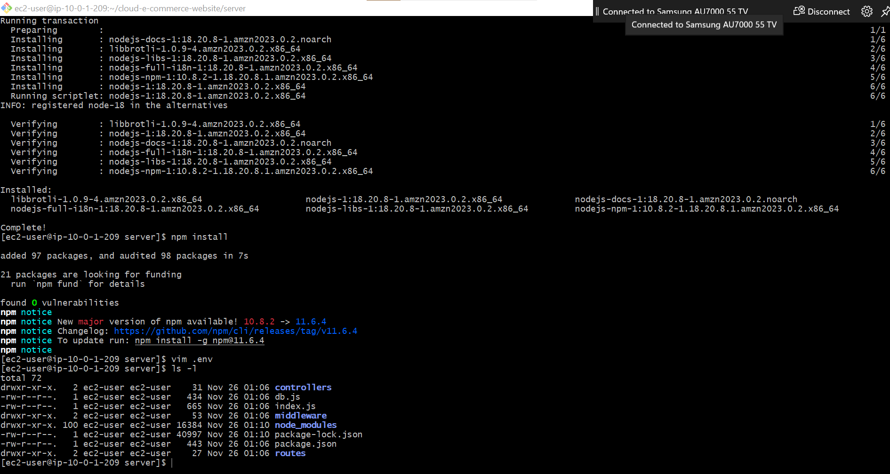

# EC2 / VPC — Night Log

**Date:** 2025-11-25  
**Author:** Amos  

---

## 1. VPC and Networking

- **Created a VPC** using Terraform with CIDR block `10.0.0.0/16`.
- **Created subnets:**
  - Public subnet (`server_sn`) for EC2 instances.
  - Private subnet (`rds_sn`) for RDS instances.
- **Created Internet Gateway** and attached it to the VPC.
- **Created route tables:**
  - Public route table → route `0.0.0.0/0` through IGW.
  - Private route table → no direct Internet access.
- **Associated subnets** with their respective route tables.

---

## 2. Security Groups

- **EC2 security group (`ec2_sg`)**
  - Inbound: HTTP (80) and SSH (22) from anywhere.
  - Outbound: All traffic allowed.
- **RDS security group (`rds_sg`)**
  - Inbound: MySQL (3306) only from EC2 security group.
  - Outbound: All traffic allowed.
- **Passed security groups between modules** using Terraform outputs/inputs.

---

## 3. EC2 Instance

- Deployed EC2 in the **public subnet**.
- Assigned **public IP** for SSH access.
- Attached **key pair (`ecommerse.pem`)**.
- Associated **EC2 security group**.
- Verified SSH access:

bash
- chmod 400 ecommerse.pem
- ssh -i "ecommerse.pem" ec2-user@<EC2_PUBLIC_IP>

